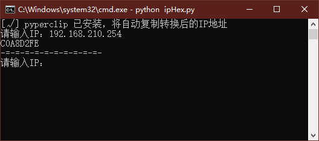

# IP to Hex in Python

一个能把IP地址变成Hex形式的神奇程序！

如安装了pyperclip包则会自动复制，如需安装请看下文



## Usage
### 1
```commandline
python ipHex.py 192.168.1.10
C0A8010A
```

### 2
```commandline
python ipHex.py
[√] pyperclip 已安装，将自动复制转换后的IP地址
请输入IP：192.168.1.1
C0A80101
-=-=-=-=-=-=-=-=-=-=-
请输入IP：
```
如需自动复制功能请自行安装
> pip install pyperclip
>
或
> pip install -r requirements.txt